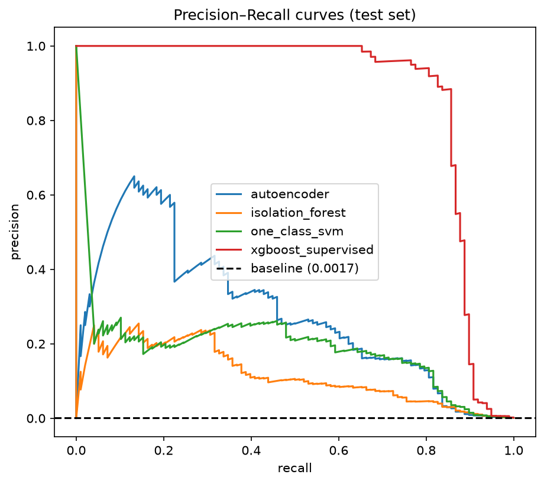
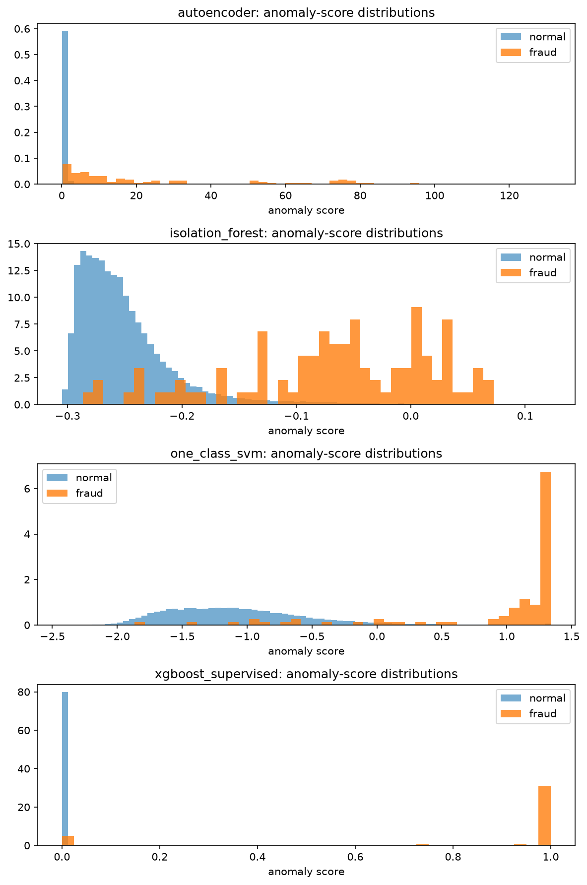

# Autoencoder Anomaly Detection — Unsupervised Fraud Detection

A deep autoencoder trained **only on legitimate transactions** learns what
"normal" looks like — then flags what it can't reconstruct. Compared
head-to-head with Isolation Forest, One-Class SVM, and a supervised XGBoost
reference on the real ULB credit-card fraud dataset (284,807 transactions,
492 frauds, 0.173%).

**The honest headline:** the supervised model wins on every metric — of
course it does, it sees the labels. The point of this project is to measure
exactly what unsupervised detection can and cannot do when labels are
unavailable, delayed, or too scarce to train on, and to show why **PR-AUC,
not ROC-AUC**, is the metric that matters at 0.17% positives.

## Problem statement

Credit-card fraud is a needle-in-haystack problem: 0.17% of transactions are
fraudulent, labels arrive weeks late (chargebacks), and fraud patterns drift.
A supervised classifier is the ceiling, but a production system needs an
answer to: *what can we catch with no labels at all?*

This project:
1. Trains a deep PyTorch autoencoder on normal transactions only.
2. Scores every transaction by reconstruction error.
3. Compares three threshold strategies (precision@k, F1-optimal, fixed-FPR),
   tuned on validation, evaluated on test.
4. Benchmarks against Isolation Forest, One-Class SVM, and supervised
   XGBoost — reporting both ROC-AUC and PR-AUC to show why the former lies.

## Methodology

- **Data:** ULB credit-card fraud dataset via public mirror (verified:
  284,807 × 31, 492 frauds). Stratified 60/20/20 split, seed 42.
  Features: V1–V28 + standardized Amount (29 total); `Time` dropped
  (documented in `data/README.md`).
- **Leakage discipline:** scaler fit on normal training data only;
  autoencoder/IF/OC-SVM trained on normal training data only; thresholds
  tuned on validation; final numbers from the held-out test set.
- **Autoencoder:** 29 → 16 → 8 → 4 → 8 → 16 → 29, ReLU, MSE loss, Adam,
  early stopping on normal validation loss.
- **Thresholds:** compared on validation; the recommended operating point is
  a **fixed 0.5% false-positive rate**, because it maps directly to
  review-team capacity (expected daily alerts = 0.5% × daily volume).
- Math derivations: `docs/math_notes.md` (manifold assumption, why ROC-AUC
  misleads under imbalance, threshold decision theory).

## Results (test set, n=56,962 — 98 frauds)

All numbers below are from the actual run (`results/metrics.json`); nothing is
invented.

### Threshold-free comparison

| Method | ROC-AUC | PR-AUC | Precision@100 | Precision@500 |
|---|---|---|---|---|
| XGBoost (supervised reference) | 0.978 | **0.869** | 0.84 | 0.18 |
| **Autoencoder (unsupervised)** | 0.947 | **0.282** | 0.34 | 0.15 |
| One-Class SVM (10k subsample) | 0.955 | 0.177 | 0.20 | 0.15 |
| Isolation Forest | 0.952 | 0.119 | 0.21 | 0.10 |

Read this table twice. First: every ROC-AUC is ≥ 0.947 — by that metric all
four methods look superb. Second: PR-AUC tells the real story. The supervised
ceiling (0.869) towers over the unsupervised methods, and among those the
autoencoder (0.282) clearly beats One-Class SVM (0.177) and Isolation Forest
(0.119) — even though the SVM has a *higher* ROC-AUC than the autoencoder.
That inversion is the entire point: **at 0.17% positives, ROC-AUC cannot
distinguish a deployable detector from a useless one.**

### Threshold strategies (autoencoder, tuned on validation)

| Strategy | Precision | Recall | F1 | FPR | Caught / Missed |
|---|---|---|---|---|---|
| precision@k (k=98) | 0.324 | 0.357 | 0.340 | 0.0013 | 35 / 63 |
| F1-optimal | 0.255 | 0.541 | 0.346 | 0.0027 | 53 / 45 |
| **Fixed FPR = 0.5% (chosen)** | 0.175 | **0.653** | 0.276 | 0.0053 | **64 / 34** |

**Recommended operating point: fixed 0.5% FPR.** It catches 64 of 98 test
frauds (65% recall) while flagging 301 legitimate transactions — about 1
false alarm per 190 transactions reviewed. It is chosen not because it
maximizes a metric (F1-optimal scores higher on F1) but because its parameter
maps to a business constraint: *expected daily reviews = 0.5% × daily
volume*. F1-optimal thresholds overfit the validation fraud mix, and
precision@k assumes you know the fraud count in advance — unknowable in
production.

### The price of label-freedom

Supervised XGBoost reaches PR-AUC 0.869; the best unsupervised method reaches
0.282. That gap — roughly 0.59 PR-AUC points — is what labels are worth on
this problem. The autoencoder is not "worse XGBoost"; it answers a different
question: what can you catch when labels are unavailable or arrive weeks
late as chargebacks.




## Quick start

```bash
python data/download.py          # fetch + verify the dataset (~102 MB)
pip install -r requirements.txt  # torch CPU: see CI workflow note below
PYTHONPATH=src python scripts/run_analysis.py
```

> **torch CPU:** install the CPU wheel first —
> `pip install --index-url https://download.pytorch.org/whl/cpu torch`
> — then `pip install -r requirements.txt`.

Run the tests:

```bash
python -m pytest tests/ -q
```

## Project structure

```
├── src/anomaly/
│   ├── data.py            # loading, stratified split, normal-only scaling
│   ├── models.py          # autoencoder, Isolation Forest, One-Class SVM, XGBoost
│   ├── train.py           # training loop with early stopping
│   ├── scoring.py         # metrics + threshold strategies
│   ├── evaluation.py      # method comparison, score diagnostics
│   └── visualization.py   # PR/ROC curves, score histograms, latent projection
├── scripts/run_analysis.py
├── data/download.py       # mirror download + verification
├── docs/math_notes.md     # derivations
├── tests/                 # 18 pytest tests
├── results/               # figures + metrics.json (real run outputs)
└── .github/workflows/ci.yml
```

## Reproducibility

- Fixed seed (42) for splits, DataLoader shuffling, model init, and all
  stochastic baselines; pinned dependencies in `requirements.txt`.
- The autoencoder trains on CPU in minutes; full pipeline wall-clock time is
  recorded in `results/metrics.json`.

## Limitations & future work

- **Random stratified split, not temporal.** Fraud patterns drift; a
  time-ordered split would be a stricter deployment proxy.
- **One-Class SVM on a 10k subsample** — the full kernel matrix on ~170k
  rows is infeasible; documented, not tuned.
- **`Time` dropped** rather than engineered into time-of-day/recency
  features a production system would use.
- The autoencoder is a plain deterministic AE; a variational autoencoder
  (reconstruction *probability*) is the natural next step, as is
  calibration of scores to fraud probabilities.
- No concept-drift monitoring: in production, rising reconstruction error
  on *all* traffic signals distribution shift, not fraud.

## References

- Dal Pozzolo et al., *Learned lessons in credit card fraud detection from a
  practitioner perspective*, Expert Systems with Applications, 2014.
  (Dataset: ULB Machine Learning Group)
- An & Cho, *Variational autoencoder based anomaly detection using
  reconstruction probability*, 2015.
- Saito & Rehmsmeier, *The precision-recall plot is more informative than
  the ROC plot when evaluating binary classifiers on imbalanced datasets*,
  PLOS ONE, 2015.
